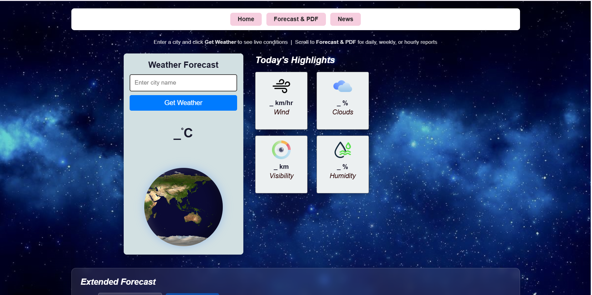
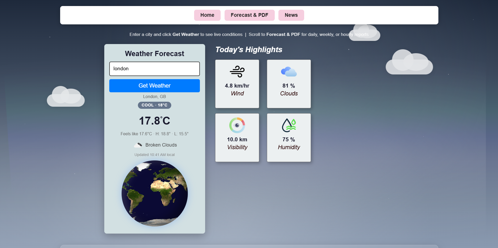
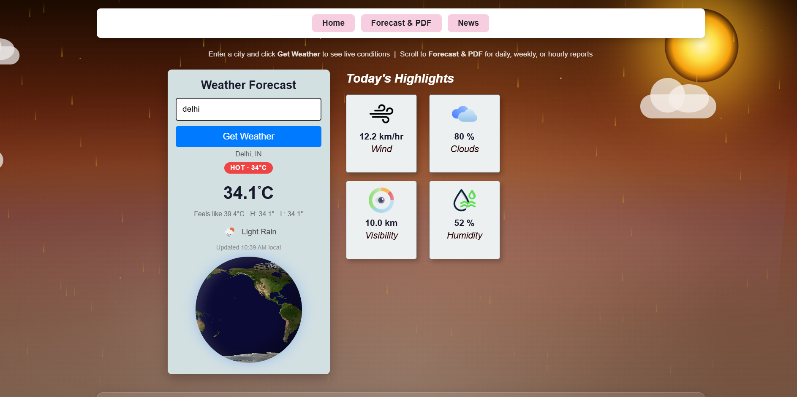
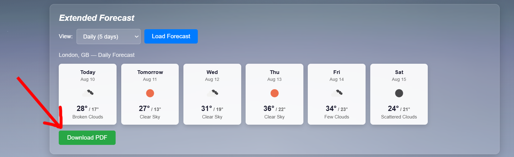
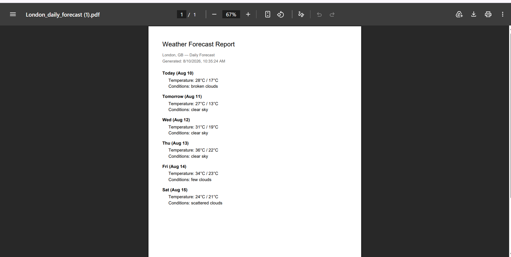

# 🌦️ Weather Forecast

> A beginner web project I built during my **1st year** while learning HTML, CSS, JavaScript, and APIs.
>
> I'm adding it to GitHub now as part of documenting the projects I've built throughout my development journey.

---

## ☁️ Preview


---

## ✨ What can it do?

### 🔎 Search & Current Weather

🌍 **Search any city**
Look up live weather information for cities around the world.


🌡️ **Current conditions**
View temperature, feels-like temperature, weather description, and other real-time information.

---

### 📊 Weather Insights

💨 **Weather highlights**
Get a quick overview of:

**Wind Speed · Humidity · Visibility · Cloud Coverage**

🌤️ **Dynamic visuals**
The interface adapts to the **weather condition, temperature, and time of day** to make the experience more visual and intuitive.


---

### 🕐 Forecasts

Choose the level of detail you need:

* 🕐 **Hourly forecast** — see how the weather changes throughout the day.
* 📅 **Daily forecast** — check upcoming daily conditions.
* 📈 **Weekly summary** — get a broader view of the days ahead.

---

### 📄 Save & Take It With You

**Download the forecast as a PDF** and keep an offline copy of the information.



This is especially useful when:

* 🏕️ Travelling to areas with limited network connectivity
* ✈️ Planning a trip before leaving home
* 🥾 Going on outdoor activities where coverage may be unreliable
* 📱 Keeping a forecast available for offline reference
* 📤 Sharing a weather report with someone else

> The PDF is a snapshot of the forecast at the time it is downloaded, so you can access that information even without reopening the app or having an internet connection.


---

### 📱 Anywhere, Any Screen

**Responsive design** that works across desktop and mobile screens.

---

## 🧩 Built With

```text
HTML5          → Structure
CSS3           → Styling & responsive design
JavaScript     → Logic & API integration
OpenWeatherMap → Live weather data
jsPDF          → PDF generation
```

---
## 🔑 API Setup

This project uses the **OpenWeatherMap API** to fetch live weather data.

To run the project locally:

1. Create a free account on OpenWeatherMap and get your API key.
2. Open `index.html`.
3. Find the following line in the JavaScript:

```javascript
const API_KEY = 'YOUR_API_KEY';
```

4. Replace `YOUR_API_KEY` with **your own OpenWeatherMap API key**.

> ⚠️ **Note:** Do not share or commit your API key publicly. For a production application, API keys should be stored securely using environment variables or a backend/server-side proxy.


## 🔄 How it works

```text
        🔎 Enter a city
               ↓
      🌐 OpenWeatherMap API
               ↓
       📦 Receive weather data
               ↓
        ⚙️ Process with JS
               ↓
      🌤️ Update the interface
               ↓
        📄 Export as PDF
```

---

## 🚀 Try it locally

1. Clone or download this repository.
2. Open the project folder.
3. Double-click **`index.html`**.
4. Enter a city and explore its weather.

That's it.

**No framework • No build tools • No complicated setup**

Just **HTML + CSS + JavaScript + an API**.

---

**🕰️ A little context**

This isn't a project I built recently.

I made it in 1st year, when I was just getting started with web development.

At the time, I was learning how websites work, how JavaScript can make a page interactive, and — most importantly — how to work with an external API and turn real-world data into something useful.

I'm uploading it now in 3rd year because I want my GitHub to reflect the projects I've built throughout my learning journey.

---

<div align="center">
        
### 🌤️ Thanks for stopping by!

⭐ If you found the project interesting, consider starring the repository.

</div>
